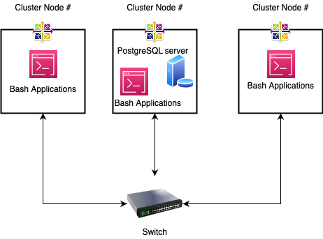

# Introduction
The Linus Cluster Monitoring project was designed to collect and understand the resource 
usage of each node in a cluster of 10 linux nodes that are connected locally via swith 
using IpV4 addresses. Jarvis LCA (Linux Cluster Adminstration) team uses this project to 
answer few critical business questions.
This project enables to get insights of over-allocation or under-allocation of resources 
and helps in taking better business decisions. To automate the processes bash script was used 
and PostgreSQL was used to store and process the collected data. Docker was used to setup a 
PostgreSQL server so that all the nodes can send the data using https protocol. Git version 
control and Gitflow workflow was followed in the implementation of the project. This project 
uses IntelliJ IDE and vim editor.
# Quick Start
* Start a psql instance using psql_docker.sh

````bash
./scripts/psql_docker.sh create|start|stop [USER_NAME][PASSWORD]
````
* Create tables using ddl.sql

````bash
psql -h psql_host -U db_username -d host_agent -f sql/ddl.sql
````
* Insert hardware specs data into the DB using host_info.sh

````bash
./scripts/host_info.sh psql_host psql_port db_name db_username db_password
````
* Insert hardware usage data into the DB using host_usage.sh

````bash
./scripts/host_usage.sh psql_host psql_port db_name db_username db_password
````
* Crontab setup

````bash
# Edit crontab job file
crontab -e 
# insert the following code to crontab
* * * * * bash /home/centos/dev/jarvis_data_eng_abhinay/linux_sql/scripts/host_usage.sh localhost 5432 host_agent postgres password > /tmp/host_usage.log
````
# Implementation
First psql_docker.sh bash script used to create, start and stop a docker instance was developed.
Next ddl.sql is implemented to initialize host_agent database which contains host_info and host_usage tables along with script to SQL queries(queries.sql) to some business questions.
After that bash scripts to collect the system information and resource usage from the node host_info.sh and host_usage.sh were implemented.
Finally, crontab job file was edited to automate the execution of host_usage application every minute.

## Architecture


## Scripts
* psql_docker.sh - To create/start/stop a PostgreSQL container
````bash
# To create a psql instance
./scripts/psql_docker.sh create USERNAME PASSWORD

# To start the psql instance
./scripts/psql_docker.sh start

# To stop the psql instance
./scripts/psql_docker.sh stop 

````
* host_info.sh - To Collect hardware specifications of host machine and insert the data into host_info table in psql instance
````bash
./scripts/host_info.sh psql_host psql_port host_agent db_username db_password

````
* host_usage.sh - To collect usage data of host machine at that instant
````bash
./scripts/host_usage.sh psql_host psql_port host_agent db_username db_password
````
* crontab - How to automate the host_usage.sh script to run every minute
````bash
# Edit crontab job file
crontab -e 
# insert the following code to crontab
* * * * * bash /home/centos/dev/jarvis_data_eng_abhinay/linux_sql/scripts/host_usage.sh localhost 5432 host_agent postgres password > /tmp/host_usage.log
````
* queries.sql - To answer
    1. Which node has the highest memory?
    1. How much memory (percentage) is on an average for every 5 min by each host?
    1. Detect unhealthy nodes using number of datapoints for every 5 min.
  ````bash
  psql -h psql_host -U db_username -d host_agent -f sql/queries.sql
  ````
## Database Modeling
- Schema of `host_info` table :
  
Column name | Data type | Description
  ---|---|---
  id | Integer | Primary key, Unique id for each host    
  hostname         | Varchar | Fully qualified hostname
  cpu_number       | SmallInt | Number of CPU's in the machine
  cpu_architecture | Varchar | Architecture of the machine
  cpu_model        | Varchar | Model of the machine
  cpu_mhz          | Decimal | Clock speed of the CPU
  l2_cache         | Integer | CPU cache (in KB)
  total_mem        | Integer | Total computer memory (in KB)
  timestamp        | Timestamp | Timestamp when the data was acquired
- Schema of `host_usage` table :
  
Column name | Data type | Description   
  ---|---|---
  timestamp      | Timestamp | Timestamp when the data was acquired
  host_id        | Integer | Unique id for each host (points to id column of host_info table)
  memory_free    | Integer | Amount of free memory (in MB)
  cpu_idle       | SmallInt | Percentage of CPU not being used
  cpu_kernel     | SmallInt | Percentage of CPU used by kernel
  disk_io        | SmallInt | Number of disk reads/writes
  disk_available | Integer | Amount of disk space available in root directory (in MB)

# Test
Testing bash scripts:
1. Passed different number of command line arguments to scripts to ensure that the script only ran for the correct number of arguments.
2. Tested output of bash commands on CLI before saving them into a variable to be used in the bash script.
3. Tested `psql_docker.sh` by passing invalid arguments for 'star|stop|create'
4. Verified the data being inserted into psql database from bash script using psql Command line.

Testing SQL scripts:
1.  Used IntelliJ ultimate database tool to test the SQL scripts.
2.  Used sample data points to ensure that every business problem is answered
# Improvements
- Automate host_info table to detect and update any hardware changes to any node using bash script
- Use indexing to improve query performance for when the number of rows becomes too big
- Develop a User Interface to further Simplify Cluster Monitoring 
